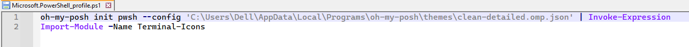
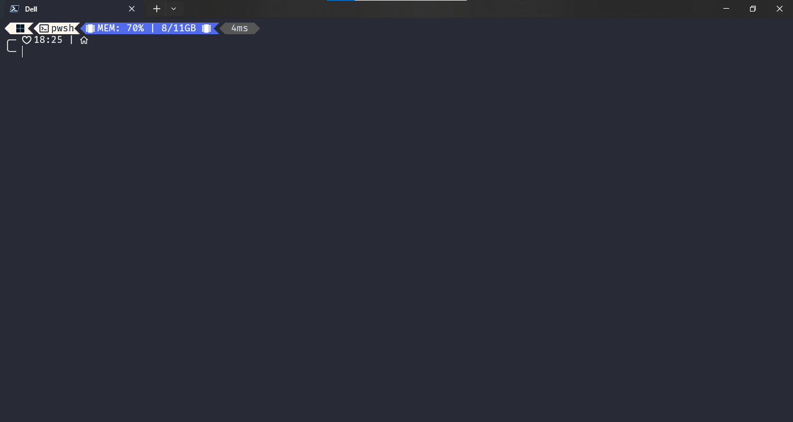
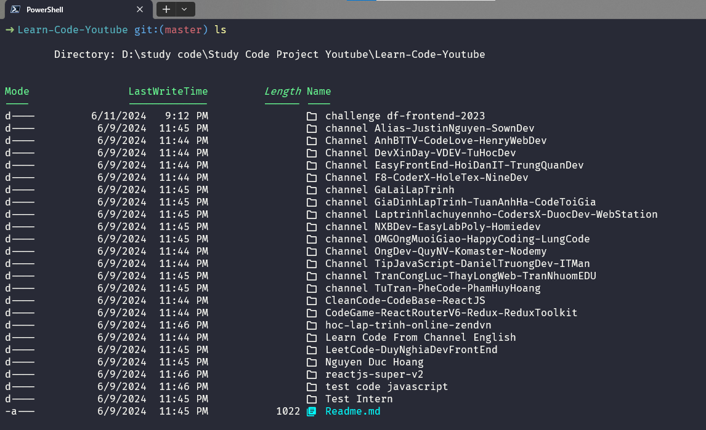

# Đây là file hướng dẫn đổi kiểu trong terminal

Mình đã theo dõi video này để cài đặt và thay đổi theme và cấu hình cho terminal trở nên đẹp hơn

[video 1](https://www.youtube.com/watch?v=d9y0l7yY404&t=1196s)
[video 2](https://www.youtube.com/watch?v=-G6GbXGo4wo)

---

Nhưng mà mình thích 2 theme này hơn `clean-detailed` và `robbyrussell`

Đây là đường dẫn PowerShell trong máy tính: `C:\Users\Dell\Documents\PowerShell`

Nếu như muốm thay đổi theme thì mình chỉ cần vào file `Microsoft.PowerShell_profile.ps1`

và thay chữ `clean-detailed` thành theme nào đó mà mình thích (ở đây mình đổi thay `robbyrussell`, `patriksvensson`, `tokyonight_storm`, thì giao diện terminal sẽ thay đổi lun)

---

Đây là giao diện theme `clean-detailed`

và đây là theme `robbyrussell`

